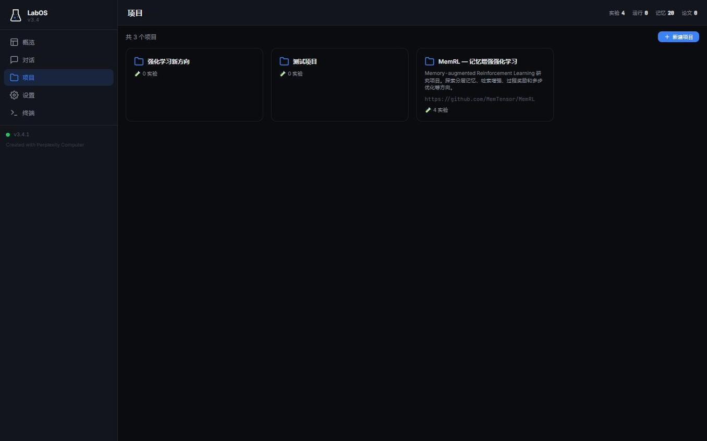
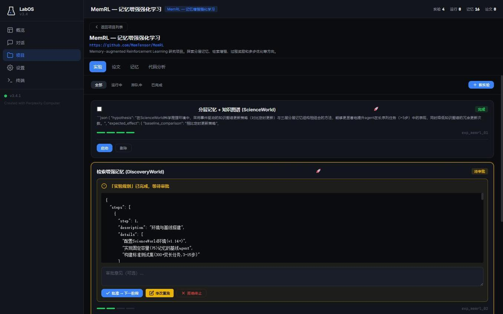
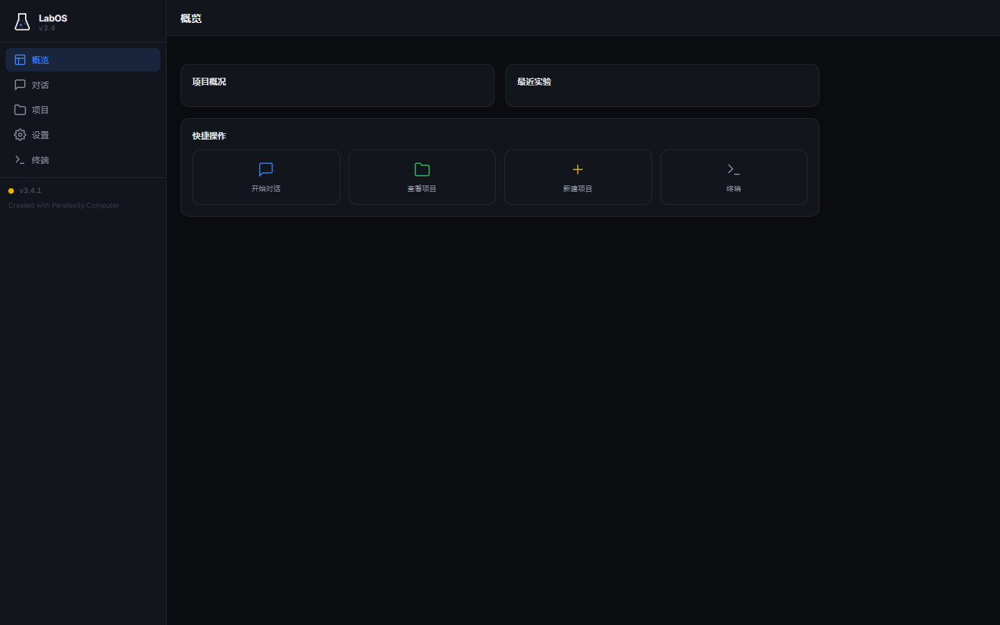

<p align="center">
  <h1 align="center">🔬 LabOS</h1>
  <p align="center"><b>Fully Automated Research System — 全自动科研实验平台</b></p>
  <p align="center">
    <a href="#features">Features</a> •
    <a href="#screenshots">Screenshots</a> •
    <a href="#quick-start">Quick Start</a> •
    <a href="#architecture">Architecture</a> •
    <a href="#open-core-model">Open Core</a> •
    <a href="#contributing">Contributing</a> •
    <a href="#support">Support</a>
  </p>
  <p align="center">
    
    
    
  </p>
</p>

---

## What is LabOS?

**LabOS** is an open-source, self-hosted platform for **fully automated research experiments**. It manages the entire research lifecycle — from idea generation and literature review, through hypothesis design and experiment execution, to final paper writing — with minimal human intervention.

**LabOS** 是一个开源的、可自部署的**全自动科研实验平台**。它管理完整的研究生命周期：从创意生成、文献调研，到假设设计、实验执行，再到论文撰写，全程最少人工干预。

### Why LabOS?

| Pain Point | LabOS Solution |
|---|---|
| 手动跑实验、反复调参 | 自动化流水线，连接远程 GPU 服务器，全自动执行 |
| 实验结果散落各处 | 统一 Dashboard，实验日志 + 报告 + 记忆系统 |
| 想法到验证周期太长 | 对话即创建项目，AI 辅助快速迭代 |
| 代码实现门槛高 | 集成 Codex CLI，AI 自动写实验代码 |

---

## Screenshots

### Project Management | 项目管理


### Experiment Pipeline | 实验流水线


### Dashboard | 概览面板


---

## Features

### 🧪 Four-Stage Research Pipeline
```
创意生成 (Ideation) → 方案设计 (Planning) → 实验执行 (Experiment) → 论文撰写 (Writing)
```
Each stage produces reports and supports human review / approval gates.

每个阶段都会生成报告（调研报告 → 分析报告 → 实验报告 → 论文），并支持人工审批。

### 💬 Chat-Driven Interface | 对话驱动
- Conversational AI assistant for research brainstorming
- Create projects directly from chat conversations
- Multiple LLM profiles: general / code / paper / experiment
- Configurable LLM backends (bring your own API key & endpoint)

### 🖥️ Remote Experiment Execution | 远程实验执行
- SSH into GPU servers (AutoDL, etc.) for experiment runs
- Real-time log streaming via SSE (Server-Sent Events)
- Codex CLI integration with full-auto mode and JSONL streaming
- Live experiment monitoring from the web dashboard

### 📊 Unified Dashboard | 统一管理
- Project management with experiment tracking
- Memory system for cross-experiment knowledge persistence
- Paper & findings library
- Per-stage reports (research → analysis → experiment → paper)

### ⚙️ Fully Configurable | 完全可配置
- Multiple LLM configurations (different models for different tasks)
- Custom API endpoints (OpenAI-compatible)
- SSH server settings
- Embedding model configuration
- All settings exposed via web UI — no code changes needed

---

## Quick Start

### Prerequisites
- Python 3.10+

### Run

```bash
git clone https://github.com/YUANXICHE98/LabOS.git
cd LabOS
pip install fastapi uvicorn paramiko httpx
python api_server.py
```

Open `http://localhost:8000` in your browser.

### First Steps
1. Go to **Settings** → configure your LLM API endpoint and key
2. (Optional) Configure SSH for remote experiment execution
3. Go to **Chat** → start a conversation → create a project from chat
4. Or go to **Projects** → create a project manually → run experiments

---

## Architecture

```
┌─────────────────────────────────────────────┐
│                  Frontend                    │
│         HTML + CSS + Vanilla JS             │
│    Dashboard / Projects / Chat / Settings    │
└──────────────────┬──────────────────────────┘
                   │ REST + SSE
┌──────────────────▼──────────────────────────┐
│              FastAPI Backend                  │
│                                              │
│  ┌──────────┐ ┌──────────┐ ┌──────────────┐ │
│  │ Pipeline │ │ Chat API │ │ Experiment   │ │
│  │ Engine   │ │ (Stream) │ │ Runner (SSH) │ │
│  └──────────┘ └──────────┘ └──────────────┘ │
│  ┌──────────┐ ┌──────────┐ ┌──────────────┐ │
│  │ Memory   │ │ LLM      │ │ Codex CLI    │ │
│  │ System   │ │ Profiles │ │ Integration  │ │
│  └──────────┘ └──────────┘ └──────────────┘ │
└──────────────────┬──────────────────────────┘
                   │
        ┌──────────┼──────────┐
        ▼          ▼          ▼
   SQLite DB   LLM APIs   GPU Servers
              (configurable)  (via SSH)
```

---

## Open Core Model | 开源核心 + 付费增值

LabOS follows an **Open Core** model:

### 🆓 Free & Open Source (this repo)
Everything in this repository is free under AGPL-3.0:
- Full research pipeline (ideation → planning → experiment → writing)
- Chat-driven interface
- Multi-project management
- LLM configuration & profiles
- Dashboard & memory system
- Basic experiment execution

### 💎 Premium (coming soon)
- **Skill Library** — Curated research methodologies, proven experiment paths, and best practices from real research projects. Think of it as a marketplace for "what worked" in different research domains.
- **Advanced Integrations** — Pre-built connectors for cloud GPU platforms, HPC clusters, and specialized hardware
- **Priority Support** — Direct access to the development team

> **Philosophy:** The platform itself will always be open. We believe the real value is in **curated knowledge and methodology** — the proven research paths and techniques that save weeks of trial and error. This is what the premium tier offers.

> **理念：** 平台本身永远开源。真正的价值在于**经过验证的研究方法论和最佳实践**——那些节省数周试错时间的成熟路径。这是付费增值的核心。

---

## Contributing

We welcome contributions! LabOS is in active development and there's plenty to work on.

See **[CONTRIBUTING.md](./CONTRIBUTING.md)** for development setup and guidelines.

### Areas We Need Help With
- 🧠 **Memory System** — better retrieval, knowledge graph integration
- 🔬 **Pipeline** — more experiment templates, domain-specific stages
- 📝 **Paper Writing** — LaTeX generation, citation management
- 🌐 **Frontend** — UI/UX improvements, visualization
- 🔌 **Integrations** — more LLM providers, cloud GPU platforms
- 📖 **Documentation** — tutorials, examples, translations
- 🌍 **i18n** — multi-language UI support

Browse [open issues](https://github.com/YUANXICHE98/LabOS/issues) for specific tasks — many are tagged `good first issue`.

---

## Roadmap

- [x] Multi-project management
- [x] Chat-to-project creation
- [x] Codex CLI real-time streaming
- [x] Multiple LLM profile configuration
- [x] SSH remote experiment execution
- [ ] arXiv paper search integration
- [ ] Experiment result visualization (charts & plots)
- [ ] Multi-user support
- [ ] Docker deployment
- [ ] Plugin system for custom pipeline stages
- [ ] Knowledge graph memory backend
- [ ] Skill library & marketplace

---

## Support the Project | 支持项目

If LabOS helps your research, consider supporting its development:

- ⭐ **Star this repo** — it helps others discover LabOS
- 🍴 **Fork & contribute** — code, docs, or translations
- 💰 **Sponsor** — help sustain development

### Crypto | 加密货币
<!-- Add your wallet addresses below -->
<!-- ETH: `0x...` -->
<!-- BTC: `bc1...` -->

### WeChat / Alipay | 微信 / 支付宝
<!-- Add QR code images:  -->

> To add your donation info: edit this section and push, or send me your wallet addresses / QR code images.

---

## License

**GNU Affero General Public License v3.0 (AGPL-3.0)**

- ✅ Free to use, modify, and distribute
- ✅ Commercial use allowed
- ⚠️ Modified versions **must** be open-sourced under AGPL-3.0
- ⚠️ Network services using modified code **must** provide source to users
- ⚠️ All derivative works must reference this upstream repository

See [LICENSE](./LICENSE) for the full text.

---

<p align="center">
  <b>Built for researchers, by researchers.</b><br>
  为科研人打造的自动化实验平台。
</p>
